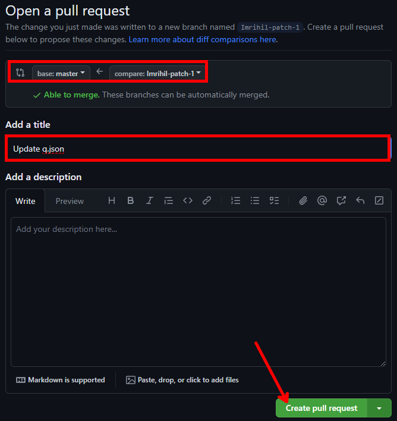
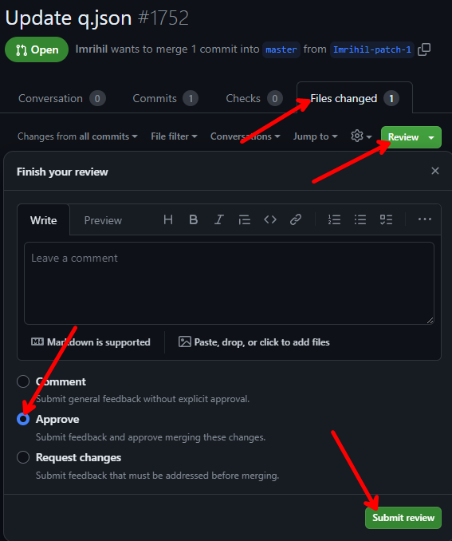

# A guide for league judges at the start of a new season

## Contribution

To change league data files you need to contribute a project with your GitHub account. If you don't have one, let's create it [here](https://github.com/signup).
Then, send your email/GitHub login to Imrihil so he can add you as a collaborator of the project.

## New season procedure (TODO)

When a new league/season/division needs to be added, some data files needs to be updated. The file structure is described [here](/README.md).

...

## Commit your changes and create a pull request
When all changes are applied, it needs to be saved. Because it's easy to make a mistake updating a file (to forget a comma or closing bracket) and also sometimes some code development is done in the same repository, it's forbidden to change files directly in a master branch. A good practice is to ask someone else for the review of your changes before merging them to master unless you are sure that you made no mistake.
All changes in a master branch are always published after a short time by the configured github action.

To save your changes you need to:
1. commit them to a new branch and then
   
   
2. create a pull request to a master,
   
3. (optional) ask someone else for a review of your changes
   
4. merge a pull request.
   